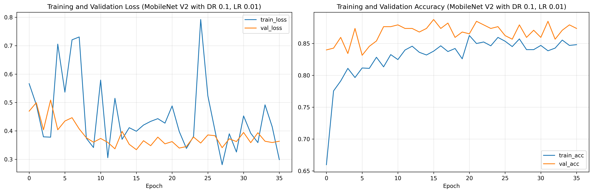
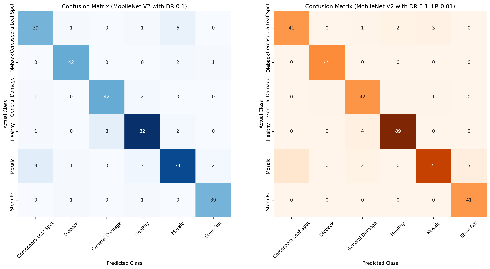

# jute-disease-detection <!-- omit from toc -->

<div align="center">
  
  <p><i>Grad-CAM: Visualizing model focus on disease symptoms.</i></p>

  <br>

  
  <p><i>Model Convergence: Training and Validation metrics.</i></p>

  <br>

  
  <p><i>Performance Benchmark: Multi-class Confusion Matrix evaluation.</i></p>
</div>

<!-- Refer to <https://shields.io/badges> for usage -->


      

An exploration of deep learning on merged jute leaf disease datasets. Created for CSC713M (Machine Learning for MSCS).

## Table of Contents <!-- omit from toc -->

- [1. Introduction](#1-introduction)
- [2. Project Structure](#2-project-structure)
- [3. Getting Started](#3-getting-started)
  - [3.1. Technical Prerequisites](#31-technical-prerequisites)
  - [3.2. Data \& Platform Credentials](#32-data--platform-credentials)
  - [3.3. Installation](#33-installation)
- [4. Reproducing the Results](#4-reproducing-the-results)
- [5. Benchmarked Performance](#5-benchmarked-performance)
- [6. Citation](#6-citation)
- [7. License](#7-license)
- [8. References](#8-references)

## 1. Introduction

This project explores classical machine learning and deep learning approaches for **jute leaf disease classification** using a unified dataset constructed from multiple open-access sources. We combine and preprocess jute leaf disease images into six classes: **Cercospora Leaf Spot, Dieback, General Damage, Healthy, Mosaic, and Stem Rot**. We then use the unified dataset to benchmark both handcrafted-feature ML pipelines and transfer-learning-based DL models.

Our experiments compare classical ML models such as **Random Forest** and **Support Vector Machine** against deep learning architectures, including **EfficientNet, ResNet, Inception, MobileViT, and MobileNetV2**. Among the evaluated deep learning models, **MobileNetV2** offered the best practical balance of efficiency and performance, achieving the strongest test accuracy while remaining compact enough for resource-constrained settings.

Beyond benchmarking, this project also investigates **fine-tuning on related plant disease datasets, input resolution effects, feature-space analysis with t-SNE/UMAP, error analysis, and Grad-CAM interpretability**. The results suggest that confusion between **Mosaic** and **Cercospora Leaf Spot** remains a key challenge, likely due to visual similarity and dataset limitations, motivating future work in improved preprocessing and multi-label disease recognition.

For a full discussion of our project, please refer to [our paper](docs/paper.pdf).

## 2. Project Structure

A high-level overview of the repository organization:

```text
.
├── artifacts/          # Models, checkpoints, and experiment logs
├── assets/             # Project visualizations (ML/DL figures)
├── configs/            # Lightning CLI configuration files (.yaml)
├── data/               # Dataset storage and class definitions
├── docs/               # Technical documentation and specifications
│   ├── architecture.md # Core technical design and implementation details
│   └── paper.pdf       # Final research paper and results documentation
├── misc/               # Project context and meta-documentation
├── notebooks/          # Notebooks for EDA and reproducibility
├── scripts/            # Automation scripts for training and evaluation
├── src/
│   ├── annotator/      # Legacy image annotation tool (Deprecated)
│   └── jute_disease/   # Main library package (DL & Classical ML)
└── tests/              # Unit and integration test suite
```

> [!NOTE]
> The **Annotator** tool (`src/annotator/`) is a legacy Flask-based component used during the early stages of the project. It is no longer actively developed or incorporated into the main training/evaluation pipeline.

For a detailed look at the internal design, public APIs, and architectural decisions, see [architecture.md](docs/architecture.md).

## 3. Getting Started

### 3.1. Technical Prerequisites

Ensure you have the following installed on your local machine:

1. **Git:** Used to clone this repository.
2. **Python `>=3.11`:** (Managed by `uv` automatically if not present).
3. **uv:** Our unified Python package and project manager. Installation instructions: <https://docs.astral.sh/uv/getting-started/installation/>.

### 3.2. Data & Platform Credentials

This project automates data acquisition and experiment tracking via third-party APIs:

1. **Kaggle API:** Required for dataset acquisition in `01_Exploratory_Data_Analysis.ipynb`. Ensure you have a `kaggle.json` in `~/.kaggle/`.
2. **Weights & Biases (WandB):** Used for experiment logs and interactive dashboards. Run `wandb login` before starting deep learning training.

### 3.3. Installation

1. Clone this repository:

   ```bash
   git clone https://github.com/qu1r0ra/jute-disease-detection
   ```

2. Navigate to the project root and install all dependencies:

   ```bash
   cd jute-disease-detection
   uv sync
   ```

## 4. Reproducing the Results

Run through the Jupyter notebooks in `notebooks/reproducibility/` in numerical order:

1. **`01_Exploratory_Data_Analysis.ipynb`**
   Consolidates the unified jute dataset and visualizes initial class distributions.
2. **`02_Model_Selection_Training_DL.ipynb`**
   Executes the baseline deep learning benchmarks (EfficientNet, MobileNetV2, etc.).
3. **`02_Model_Selection_Training_ML.ipynb`**
   Extracts handcrafted features (HOG, LBP, Color Hist) for classical ML training.
4. **`03_Model_Analysis_Tuning_DL.ipynb`**
   Performs deep learning hyperparameter tuning and generates Grad-CAM heatmaps.
5. **`03_Model_Analysis_Tuning_ML.ipynb`**
   Performs ML error analysis and hyperparameter tuning (Grid Search).
6. **`04_Model_Evaluation.ipynb`**
   Finalizes evaluation on the held-out test set and identifies top failure modes.

> [!NOTE]
> When running a notebook, select the **`.venv`** in the project root as your Jupyter kernel.

## 5. Benchmarked Performance

Below is a summary of our primary results. For a detailed discussion on learning rates, input resolutions, and feature space analysis, refer to the [paper](docs/paper.pdf).

| Model Class       | Architecture / Classifier | Feature Extraction     | Val Acc (%) | Test Acc (%) |
| :---------------- | :------------------------ | :--------------------- | :---------- | :----------- |
| **Deep Learning** | MobileNetV2               | Fine-tuned ImageNet    | TBD         | **91.4%**    |
| **Deep Learning** | EfficientNet-B5           | Fine-tuned ImageNet    | TBD         | TBD          |
| **Classical ML**  | Random Forest             | HOG + LBP + Color Hist | TBD         | 86.2%        |

## 6. Citation

If you find this research or codebase useful in your own work, please consider citing our paper:

```bibtex
@techreport{bunyi2026jute,
  title={An Application of Machine Learning and Deep Learning on Small-Scale Jute Leaf Disease Datasets},
  author={Bunyi, Christian Joseph and Umali, Immanuel},
  year={2026},
  institution={De La Salle University},
  type={Technical Report},
  url={https://github.com/qu1r0ra/jute-disease-detection}
}
```

## 7. License

This project is licensed under the **Apache License 2.0**. See the [LICENSE](LICENSE) file for the full text.

## 8. References

- Islam, M. M., & Sheikh, M. R. (2026). A comprehensive image dataset of jute diseases. _Data in Brief, 64_, 112334. <https://doi.org/10.1016/j.dib.2025.112334>

- Jannat, M., Uddin, M. S., Hasan, M. A., Alam, M. S., Paul, A., Chowdhury, M. E. H., & Haider, J. (2025). Real-time jute leaf disease classification using an explainable lightweight CNN via a supervised and semi-supervised self-training approach. _Frontiers in Plant Science, 16_. <https://doi.org/10.3389/fpls.2025.1647177>

- Mridha, M. H. (2024). _Jute plant leaves_ (Version 1) [Data set]. Mendeley Data. <https://doi.org/10.17632/z87b9hnkh7.1>

- Mohanty, S. P., Hughes, D. P., & Salathé, M. (2016). Using deep learning for image-based plant disease detection. _Frontiers in Plant Science, 7_. <https://doi.org/10.3389/fpls.2016.01419>

- Singh, D., Jain, N., Jain, P., Kayal, P., Kumawat, S., & Batra, N. (2020). _PlantDoc: A dataset for visual plant disease detection_. In _Proceedings of the 7th ACM IKDD CoDS and 25th COMAD_ (pp. 249–253). <https://doi.org/10.1145/3371158.3371196>
